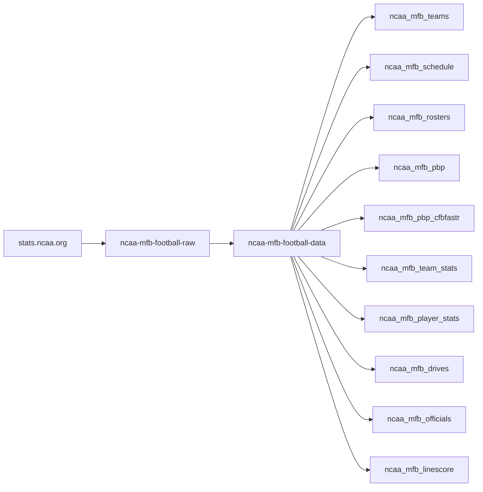
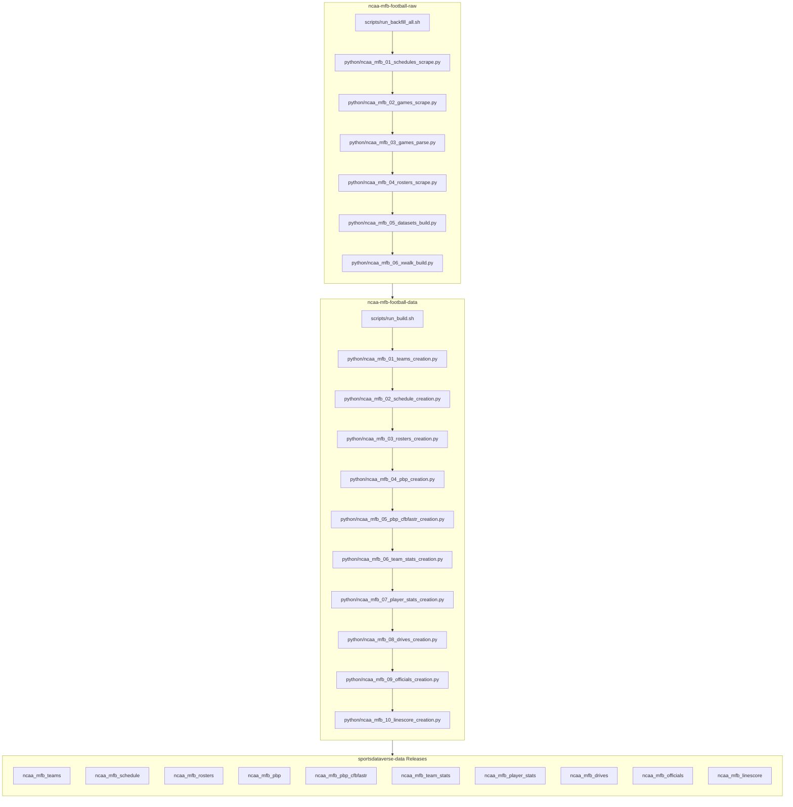

# ncaa-mfb-football-raw

Raw scraper + captured game data for **NCAA Men's Football (MFB)** from
`stats.ncaa.org`, in the SportsDataverse Python stack. Mirrors
`ncaa-mbb-hoops-raw` (discover → capture → parse → datasets) and rides the
canary-proven `decodo_patchright` transport (patchright + `--headless=new` +
Decodo US sticky residential; see `canary_vendors.toml.example`).

**Status:** live capture running for the 2025 season (`academic_year=2026`).
Discovery, schedules, rosters, and 6-tab game bundles are wired end-to-end;
parsing graduates to sdv-py (`cfb_ncaa_pbp` / `cfb_ncaa_box`), with the
cfbfastR column-parity mapping prototyped here (`mfb_cfbfastr.py`, 102
cfbfastR-named columns incl. parity-tested running scores). See
[docs/DESIGN.md](docs/DESIGN.md) for the phased plan and decision log.

## ncaa-mfb-football workflow diagram





`scripts/run_backfill_all.sh` (raw) and `scripts/run_build.sh` +
`scripts/run_publish.sh` (data) are the drivers. Stage numbers are intended
build order, not run order.

[ncaa-mfb-football-raw repository (source: stats.ncaa.org)](https://github.com/sportsdataverse/ncaa-mfb-football-raw)

[ncaa-mfb-football-data repository (source: stats.ncaa.org)](https://github.com/sportsdataverse/ncaa-mfb-football-data)

[cfbfastR-cfb-raw repository (source: ESPN)](https://github.com/sportsdataverse/cfbfastR-cfb-raw)

[cfbfastR-cfb-data repository (source: ESPN)](https://github.com/sportsdataverse/cfbfastR-cfb-data)

## Repository layout

<!-- BEGIN GENERATED: layout -->

```
ncaa-mfb-football-raw/
├── docs/   # explainers, model reports and dataset docs
├── mfb/
│   ├── json/
│   ├── raw/
│   ├── rosters/
│   ├── schedules/
│   ├── teams/
│   └── xwalk/
├── python/   # Python pipeline stages, numbered in build order
│   ├── ncaa_mfb_raw_scrape/
│   ├── ncaa_mfb_01_schedules_scrape.py
│   ├── ncaa_mfb_02_games_scrape.py
│   ├── ncaa_mfb_03_games_parse.py
│   ├── ncaa_mfb_04_rosters_scrape.py
│   ├── ncaa_mfb_05_datasets_build.py
│   └── ncaa_mfb_06_xwalk_build.py
├── scripts/   # bash drivers (the daily/weekly entry points)
│   ├── _env.sh
│   ├── run_01_schedules.sh
│   ├── run_02_games.sh
│   ├── run_03_parse.sh
│   ├── run_04_rosters.sh
│   ├── run_05_datasets.sh
│   ├── run_06_xwalk.sh
│   ├── run_backfill_all.sh
│   └── run_mfb_capture.sh
└── tests/   # test suite
    ├── fixtures/
    ├── test_mfb_capture.py
    ├── test_mfb_cfbfastr.py
    ├── test_mfb_datasets.py
    ├── test_mfb_discover.py
    ├── test_mfb_parse.py
    └── test_mfb_stages.py
```

<!-- END GENERATED: layout -->

## Running

Numbered stages (full table, resumability, backfill: [RUNBOOK.md](RUNBOOK.md)):

```sh
export NCAA_VENDOR=decodo_patchright                                  # canary_vendors.toml creds
./scripts/run_01_schedules.sh --academic-year 2026 --division 11     # discovery (team pages)
./scripts/run_04_rosters.sh   --academic-year 2026 --division 11     # roster pages
./scripts/run_02_games.sh     --academic-year 2026 --division 11 --max-contests 200   # game bundles
./scripts/run_05_datasets.sh  --academic-year 2026                   # OFFLINE: tidy parquet
./scripts/run_06_xwalk.sh     --academic-year 2026                   # OFFLINE: NCAA<->ESPN game crosswalk -> mfb/xwalk/
# watch: tail -f logs/<schedules|rosters|games|datasets>_<ts>.log
```

`academic_year` is the ENDING year (2026 = fall-2025 season). Division 11 =
FBS, 12 = FCS (run the online stages once per division). All stages are
file-exists resumable; a consecutive-failure breaker hard-stops ban storms.
`./scripts/run_mfb_capture.sh` is the combined one-session runner (01 + 04 +
02) for chunked one-shot runs. Backfill = the same stages with a different
`--academic-year`.

## Known source gaps (2025 season)

* **No pbp published** for 2 of 1,687 contests — Furman @ Campbell
  (`6419926`, 09/13) and Bethune-Cookman @ Grambling (`6400590`, 11/08):
  stats.ncaa.org serves a ~21 KB stub. Finals live in the schedule master.
* **OT drives are omitted from pbp pages** — reconstructed one-row-per-drive
  from the drives tab + scoring-summary checkpoints, flagged
  `ot_synthesized=True` in `pbp_cfbfastr`.
* Some FCS pages label drive h5 titles with the DEFENSE and/or misalign drive
  numbers across tabs; both are auto-corrected (drive-start-marker vote,
  score-based OT alignment). QA: `datasets/{ay}/qa_pbp_vs_linescore.parquet`
  — 1,685/1,685 exact finals for 2025.

## Game-detail tabs

Each bundle captures `play_by_play` (validity gate) plus `box_score`,
`team_stats`, `individual_stats`, `drives`, `officials`. There is **no
participation tab** on stats.ncaa.org football pages — `individual_stats`
(anyone credited with a stat) is the closest surface.

## Runtime

Requires a US residential transport — datacenter IPs get an instant Akamai
edge 403. Capture holds ONE browser session (a rapid relaunch storm across
proxies crashes the patchright driver with EPIPE); sticky session ids are
re-minted per run by the sdv-py vendor seam.

## Reports & explainers

<!-- BEGIN GENERATED: reports -->

| Report | What it is | Last updated |
|---|---|---|
| [NCAA Men's Football (MFB) play-by-play — design + plan](docs/DESIGN.md) | explainer | 2026-07-16 |

<!-- END GENERATED: reports -->

## Automation & status

<!-- BEGIN GENERATED: status -->

| workflow | schedule | last run |
|---|---|---|
| _none_ | — | — |

<!-- END GENERATED: status -->

## Consumers

The packages that read what this repo produces:

- **R:** [cfbfastR](https://cfbfastR.sportsdataverse.org) — docs at <https://cfbfastR.sportsdataverse.org>
- **Python:** [`sportsdataverse.cfb (cfb_ncaa_*)`](https://github.com/sportsdataverse/sportsdataverse-py) — docs at <https://py.sportsdataverse.org>

## Stage inventory

Every numbered pipeline stage in `python/` (auto-listed; run subsets with the `scripts/*.sh` drivers by number or name):

- `python/ncaa_mfb_01_schedules_scrape.py`
- `python/ncaa_mfb_02_games_scrape.py`
- `python/ncaa_mfb_03_games_parse.py`
- `python/ncaa_mfb_04_rosters_scrape.py`
- `python/ncaa_mfb_05_datasets_build.py`
- `python/ncaa_mfb_06_xwalk_build.py`
